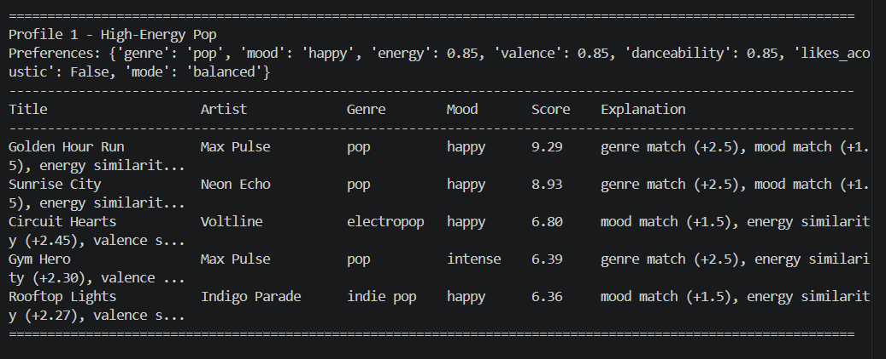
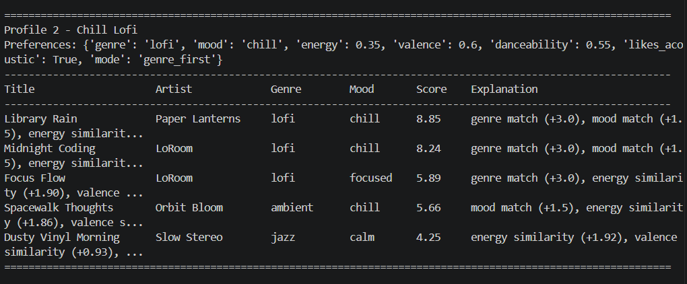
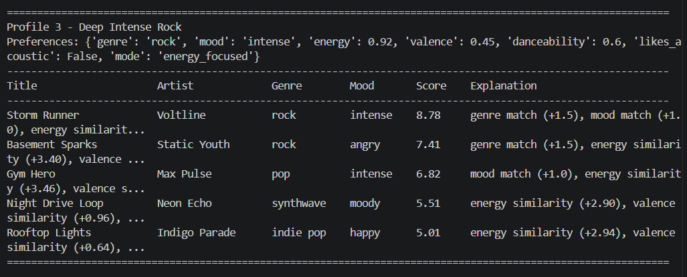
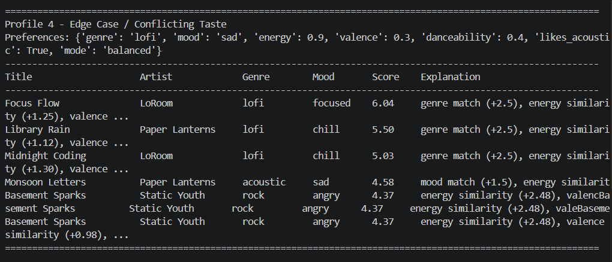

# Music Recommender Simulation

## Project Summary

In this project, I built a small content-based music recommender in Python. Real music platforms like Spotify, YouTube, and TikTok often use a mix of user behavior data and item features to decide what to recommend. Behavior data can include likes, skips, replays, playlists, or watch time. Item features can include genre, mood, tempo, energy, or other qualities that describe the song itself.

A real-world recommender often combines two ideas. **Collaborative filtering** uses patterns from many users and recommends items that similar users also enjoyed. **Content-based filtering** recommends items that are similar to what a user already prefers. My version is a simplified content-based recommender. It does not use listening history from other users. Instead, it compares each song’s features to one user profile and gives each song a weighted score.

## How The System Works

Each song in my dataset stores these features:

- title
- artist
- genre
- mood
- energy
- tempo_bpm
- valence
- danceability
- acousticness

The user profile stores preferences such as:

- preferred genre
- preferred mood
- target energy
- target valence
- target danceability
- whether the user likes acoustic songs
- ranking mode

The system scores each song using a weighted recipe:

- genre match adds a large bonus
- mood match adds a smaller bonus
- energy similarity rewards songs whose energy is close to the user target
- valence similarity rewards songs whose emotional tone is close
- danceability similarity rewards songs with a similar groove level
- acousticness adds either an acoustic bonus or a non-acoustic bonus depending on the profile

After scoring all songs, the recommender sorts them from highest to lowest. I also added a small diversity penalty so the top results do not repeat the same artist or genre too often. This makes the recommendations feel more varied and less stuck in a filter bubble.

### Simple Flow

**Input:** user preferences  
**Process:** compare the profile against every song in the CSV and compute a score  
**Output:** ranked top-k recommendations with explanations

## Getting Started

### Setup

Create a virtual environment if you want:

```bash
python -m venv .venv
```

Activate it:
```bash
# Mac or Linux
source .venv/bin/activate

# Windows
.venv\Scripts\activate
```

Install dependencies:
```bash
pip install -r requirements.txt
```

Run the app:
```bash
python -m src.main
```

Running Tests
```bash
pytest
```

## Example Profiles I Tested

I tested the recommender using these user profiles:

1. **High-Energy Pop**
   - likes pop
   - happy mood
   - high energy
   - high danceability
   - prefers non-acoustic songs

2. **Chill Lofi**
   - likes lofi
   - chill mood
   - low energy
   - likes acoustic songs
   - uses genre-first mode

3. **Deep Intense Rock**
   - likes rock
   - intense mood
   - very high energy
   - prefers non-acoustic songs
   - uses energy-focused mode

4. **Edge Case / Conflicting Taste**
   - likes lofi
   - wants sad mood
   - very high energy
   - likes acoustic songs

---

## Experiments I Tried

### Experiment 1: Multiple Ranking Modes

I created three ranking modes:

- balanced  
- genre_first  
- energy_focused  

This changed how strongly the system reacted to genre versus numeric similarity. For example, the rock profile worked better with energy-focused mode because it pushed high-energy tracks higher even when their mood was not a perfect match.

---

### Experiment 2: Diversity Penalty

Without a penalty, the top results could include too many songs by the same artist or too many songs from the same genre.

I added a small penalty when an artist or genre was already present in the recommendation list. This improved variety and made the final top 5 feel more realistic.

---

### Experiment 3: Stress Testing with Conflicting Preferences

I tested an edge-case profile that asked for:
- lofi
- sad mood
- very high energy
- acoustic songs

The results were less intuitive, which showed that a simple scoring system can struggle when the user preferences conflict with the available catalog.

---

## What Changed Across Profiles

The outputs changed in a way that mostly made sense:

- The **High-Energy Pop** profile pushed upbeat and danceable songs like pop and electropop higher.
- The **Chill Lofi** profile preferred low-energy and acoustic songs, especially lofi tracks.
- The **Deep Intense Rock** profile moved rock and high-energy songs to the top.
- The **Conflicting Taste** profile showed one weakness of the model: when preferences clash, the system picks songs that partially match instead of truly understanding intent.

---

## Screenshots

### Screenshot 1 - High-Energy Pop


### Screenshot 2 - Chill Lofi


### Screenshot 3 - Deep Intense Rock


### Screenshot 4 - Conflicting Taste


---

## Limitations and Risks

This recommender has several limitations:

- It only works on a very small catalog of songs.
- It does not use real listening history, skips, replays, playlists, or social signals.
- It may over-prioritize a strong genre match even when another song feels better overall.
- It still simplifies taste into a few numbers, which is not how real human preference works.
- If the dataset under-represents certain genres or moods, those listeners will get weaker results.

---

## Reflection

This project helped me understand how recommendation systems turn data into predictions. A recommender is really just a set of choices about what features matter and how much they should count. Even a simple weighted scoring function can feel surprisingly smart when the features line up well.

It also showed me how bias can appear very easily. If a dataset has more pop songs than other genres, then pop can dominate the results. If genre is weighted too strongly, the system can keep recommending the same type of songs. That is why transparency, evaluation, and diversity matter in recommender systems.